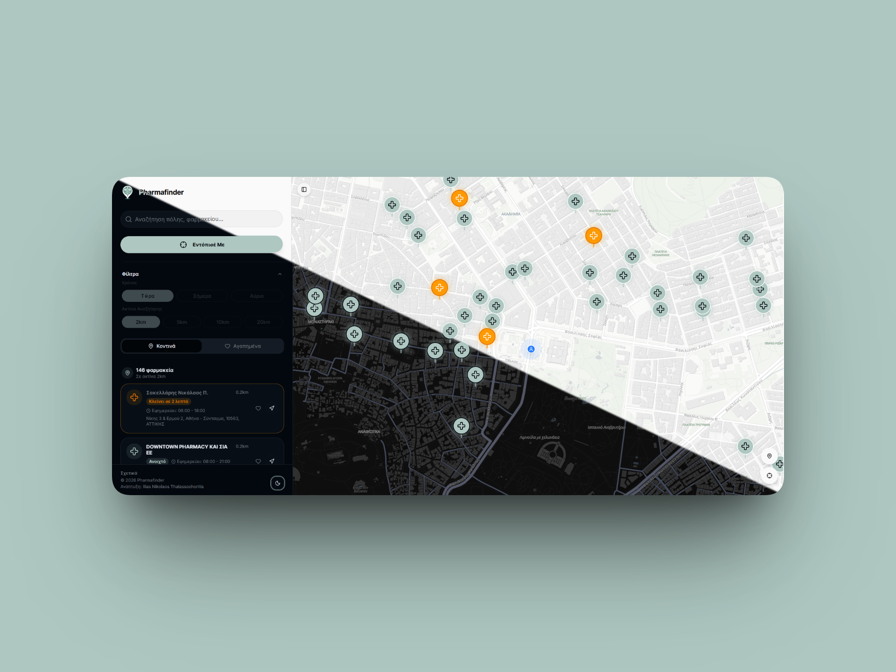
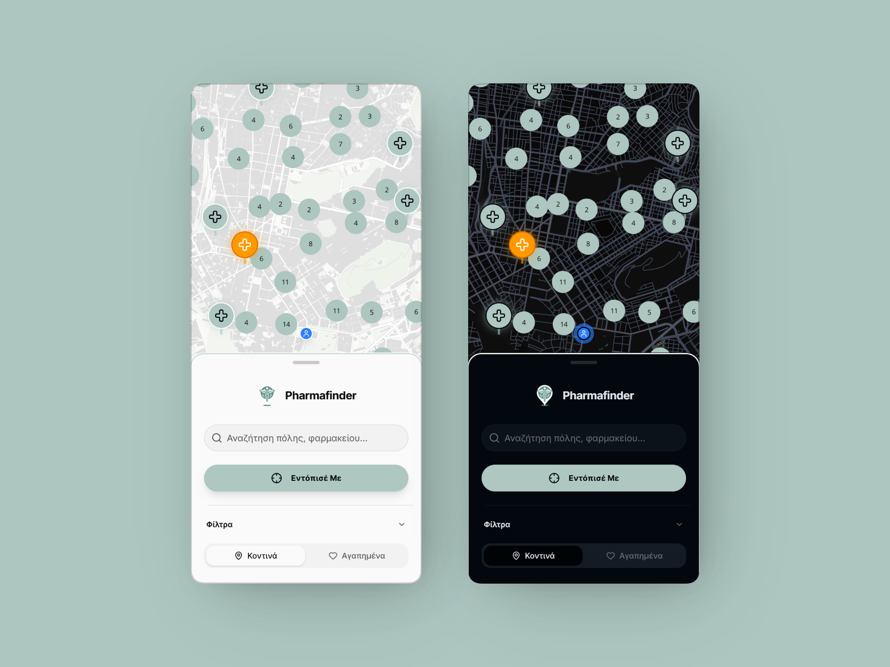

# 🏥 PharmaFinder Greece


> **Find on-duty pharmacies near you, anytime, anywhere in Greece.**

PharmaFinder is a modern, high-performance web application designed to help users locate on-duty pharmacies (εφημερεύοντα φαρμακεία) across Greece. Built with the latest web technologies, it offers a seamless experience with an interactive map, real-time filtering, and a mobile-first design.


[](https://www.react.doctor/share?p=pharmafinder-greece&s=90&e=13&w=127&f=109)

## ✨ Key Features

- **🗺️ Interactive Map**: Powered by **MapLibre GL**, featuring high-performance clustering, custom markers, and smooth transitions.
- **📍 Geolocation**: Automatically detects user location on page load. Falls back to IP-based geolocation if browser permission is denied.
- **❤️ Favorites**: Save your preferred pharmacies to localStorage; favorites appear on the map with a red indicator and are always visible regardless of radius.
- **🌓 Dark/Light Mode**: Fully supported system-aware theme switching.
- **🔍 Smart Filtering**: Filter by city, time, and radius.
- **🔗 Deep Linking**: URL-based state management using **Nuqs**, allowing users to share exact search results and map views.
- **📱 Mobile First**: Responsive design optimized for all device sizes.
- **⚡ High Performance**: Utilizing **TanStack Query** for efficient data fetching and caching.

## 📸 Screenshots

### Desktop



### Mobile



## 🛠️ Tech Stack

This project is engineered with a focus on scalability, maintainability, and performance.

### Core

- **[Next.js 16](https://nextjs.org/)** - The React Framework for the Web (App Router).
- **[React 19](https://react.dev/)** - The library for web and native user interfaces.
- **[TypeScript](https://www.typescriptlang.org/)** - Strongly typed programming language.

### UI & Styling

- **[Tailwind CSS v4](https://tailwindcss.com/)** - Utility-first CSS framework.
- **[shadcn/ui](https://ui.shadcn.com/)** - Re-usable components built with Radix UI and Tailwind CSS.
- **[MapLibre GL](https://maplibre.org/)** - Open-source mapping library.
- **[Lucide React](https://lucide.dev/)** - Beautiful & consistent icons.

### State & Data

- **[Zustand](https://zustand-demo.pmnd.rs/)** - Small, fast and scalable bearbones state-management solution.
- **[TanStack Query](https://tanstack.com/query/latest)** - Powerful asynchronous state management.
- **[Nuqs](https://nuqs.47ng.com/)** - Type-safe search params state manager for Next.js.

## 🏗️ Architecture

The project follows the **Feature-Sliced Design (FSD)** methodology, ensuring a loosely coupled and highly cohesive codebase.

```
src/
├── app/          # App Router entry points (pages, layouts)
├── widgets/      # Compositional layers (complex UI blocks)
├── features/     # User scenarios (search, filter, locate)
├── entities/     # Business entities (pharmacy, city)
├── shared/       # Reusable infrastructure code (UI kit, api, libs)
└── ...
```

This structure allows for better scalability and easier refactoring as the application grows.

## 🧪 Quality & Testing

The project implements **Test-Driven Development (TDD)** principles using a modern testing stack:

- **[Jest](https://jestjs.io/)**: Robust JavaScript testing framework.
- **[React Testing Library](https://testing-library.com/docs/react-testing-library/intro/)**: Standard for testing React components.
- **Automated Verification**:
  - **Unit Tests**: Coverage for complex business logic (e.g., pharmacy status calculations).
  - **Server Component Tests**: Integration tests for Next.js Server Components, verifying data fetching, metadata generation, and routing logic.
  - **Mocking Strategy**: Isolated testing of business logic from external APIs and Next.js internal modules.

## 🚀 Getting Started

### Prerequisites

- **Node.js** (v20+ recommended)
- **Bun** (preferred) or npm/yarn

### Installation

1.  Clone the repository:

    ```bash
    git clone https://github.com/eliac7/pharmafinder-greece.git
    cd pharmafinder-greece
    ```

2.  Install dependencies:

    ```bash
    bun install
    # or
    npm install
    ```

3.  Set up environment variables:
    Create a `.env.local` file in the root directory (use `.env.example` as a reference):

    ```env
    # App
    NEXT_PUBLIC_APP_URL=http://localhost:3000

    # Backend API
    API_BASE_URL=http://localhost:8000
    API_SECRET_KEY=your_api_secret_key

    # Security
    ENCRYPTION_SECRET=your_encryption_secret
    ENCRYPTION_SALT=your_encryption_salt

    # Services
    NEXT_PUBLIC_GOOGLE_MAPS_API_KEY=your_key_here
    NEXT_PUBLIC_TURNSTILE_SITE_KEY=your_site_key
    NEXT_PUBLIC_GA_MEASUREMENT_ID=G-XXXXXXXXXX
    ```

4.  Run the development server:

    ```bash
    bun dev
    # or
    npm run dev
    ```

5.  Open [http://localhost:3000](http://localhost:3000) with your browser to see the result.

## 📜 Scripts

- `bun dev`: Starts the development server.
- `bun build`: Builds the application for production.
- `bun test`: Runs the Jest test suite.
- `bun start`: Starts the production server.
- `bun lint`: Runs ESLint to check for code quality issues.

## 🤝 Contributing

Contributions are welcome! Please feel free to submit a Pull Request.

1.  Fork the project
2.  Create your feature branch (`git checkout -b feature/AmazingFeature`)
3.  Commit your changes (`git commit -m 'Add some AmazingFeature'`)
4.  Push to the branch (`git push origin feature/AmazingFeature`)
5.  Open a Pull Request

## 📄 License

This project is licensed under the MIT License - see the [LICENSE](LICENSE) file for details.

## 👨‍💻 Author

**Ilias Nikolaos Thalassochoritis**

- Website: [ilias.dev](https://ilias.dev)
- Email: iliascodes@gmail.com
- GitHub: [@eliac7](https://github.com/eliac7)
